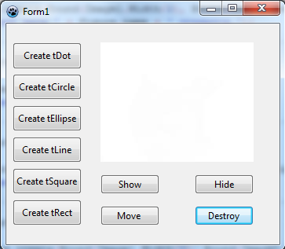
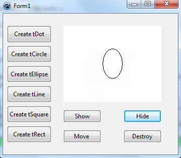

# Pascal-OOP

В этом репозитории вы найдёте выполненные задания по ООП на языке Pacal в среде Lazarus. Для каждого задания создана отдельная папка.
Для того, чтобы у вас заработал код с графическими объектами, необходимо создать форму с этими объектами. 
Ниже для каждого задания показана нужная форма.    

:warning:  *Cначала рекомендуется  решать самим.*

#### Первое задание (---) 

#### Второе задание (---)

#### Третье задание (project_Dot)

#### Четвёртое задание (project_Circle)

#### Пятое задание (hierarchy_figures)
*Для корректной работы с tImage нужно поместить в его свойство "Picture" белую картинку.*

 ----- 
