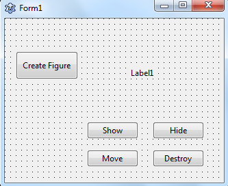
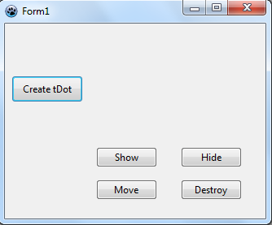
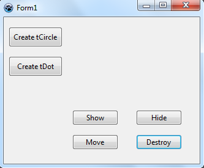
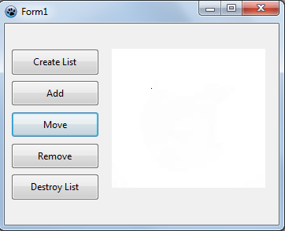
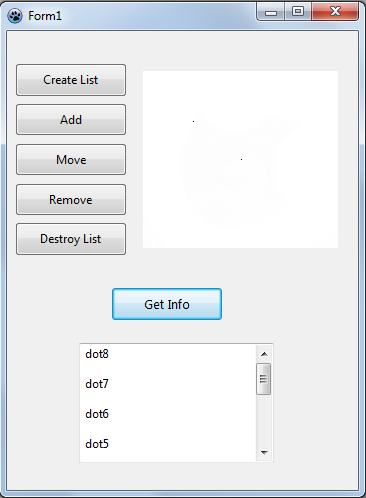
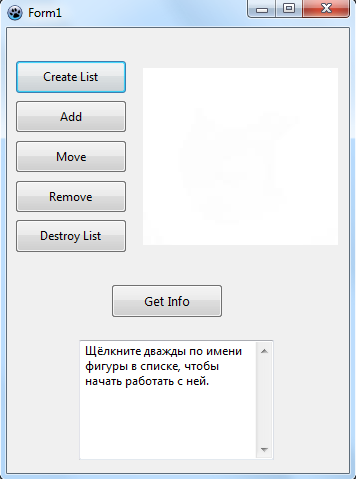
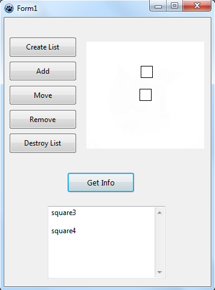

# Pascal-OOP

В этом репозитории вы найдёте выполненные задания по ООП на языке Pacal в среде Lazarus. Для каждого задания создана отдельная папка.
Для того, чтобы у вас заработал код с графическими объектами, необходимо создать форму с этими объектами и каждому объекту добавить необходимые свойства и события (onClick для кнопок и др.). 
Ниже для каждого задания показана нужная форма.    

#### Первое задание (task1) 

#### Второе задание (task2)

#### Третье задание (project_Dot)

#### Четвёртое задание (project_Circle)

#### Пятое и шестое задание (hierarchy_figures)
*Для корректной работы с tImage нужно поместить в его свойство "Picture" белую картинку.*

 ----- 

#### Седьмое задание (List_from_end)

#### Восьмое задание (task8)

#### Девятое задание (task9)

#### Десятое задание (task11)
Просто **удалите из одиннадцатого задания метод redraw()** в файле figures.pas. Там где он используется (например, в методах add, remove и других) замените redraw() на pLastNode^.figure.show().

#### Одиннадцатое задание (task11)

